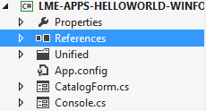

[](http://www.lotaris.com)

# Lotaris 15 min integration guide for Windows Store Apps

## Summary
Welcome to Lotaris developer guide. This document will guide you through the steps required to integrate your application with Lotaris in-appCommerce.
The Lotaris Client Library uses the same terminology and shares most of its API with the Windows Store API.
An **application** in this guide represents your application. Windows Store Apps integrated with Lotaris in-appCommerce are distributed through Windows Store as free download. Lotaris in-appCommerce is used to monetize your application after download.
An **In-App Offer** represents a paid feature in your application accessible by the consumers after an in-app purchase.

## Registration
1. In order to create an account please go to https://tools.onlotaris.com/en/register
2. Once registered you can access the Lotaris Console here: https://tools.onlotaris.com/en/login

## Tutorial Video
A short screencast guiding you through the account and application setup process on the Lotaris Console.

<a href="http://www.youtube.com/watch?feature=player_embedded&v=eCIARN4NomE
" target="_blank"></a>

## Installation
1. Download the Lotaris library and layouts from [here](./Store\ Apps\ SDK) (both .dll files and Lotaris.LmeCl.Metro folder. The Lotaris.LmeCl.Metro folder must be in the same directory as the .dll files)
2. Make a reference of the library into your C# project:



Right click on the *References* item under your project. Click on *Add reference...* and select *Browse....* and select the libraries Lotaris.LmeCl.Core.dll and Lotaris.LmeCl.Metro.dll.

## Initializing the Lotaris Library
First import the Lotaris namespace `Lotaris.LmeCl.Store` then initialize the Lotaris library by calling the method `CurrentApp.InitializeLicensing` in order to use the Lotaris features.
This method should be called only once, you should call it in your `App.xaml.cs` once your UI has been built.

**API Reference**
```C#
async static Task CurrentApp.InitializeLicensing(string endpointUrl, string credentialId, 
    string credentialPassword, Action<Exception> onNonCriticalFailure = null, 
    float offlineGracePeriod = 2 * 24 * 60 * 60)
 ```
The following parameters must be set:
+ endpointUrl: allows you to set the endpoint URL for communicating with the Lotaris  Server. "https://lme.onlotaris.com/core" should be used.
+ ID: ID for your application. This information can be obtained in the Lotaris Console on your application details page.
+ Password: Password for your application. This information can be obtained in the Lotaris Console on your application details page.

Note: In case the initialization fails, for example if there is no connection to the Lotaris Server, the optional callback will be called and the Lotaris library will continue to function in “offline grace period” mode. Offline grace period is optional and defined by your application as the last initilization parameter. If you do not explicitly set it, the default is set to 2 days.

**Sample code**

*Application entry point*
```C#
// App.xaml.cs
// Can be queried to know whether licensing information is currently available
public bool IsLicensingInitializationFinished { get; private set; }
// Raised when the licensing is loaded. Will contain an exception if there were errors while initializing the licensing.
public event Action<Exception> LicensingFinished;
protected async override void OnLaunched(LaunchActivatedEventArgs args)
{
	...
        Exception possibleException = null;
        await CurrentApp.InitializeLicensing("https://lme.onlotaris.com/core", 
	      "ADD_YOUR_APP_ID_HERE", 
	      "ADD_YOUR_PASSWORD_HERE", 
	      exception => { possibleException = exception; });
        IsLicensingInitializationFinished = true;
        if (LicensingFinished != null)
        {
                LicensingFinished();
        }
}
```
*Application page*
```C#
// YourViewModel.cs
public YourViewModel()
{
        App myApp = Application.Current as App;
        if (myApp.IsLicensingInitializationFinished)
        {
                UpdateUiWithLicensingInformation();
        }
        else
        {
                myApp.LicensingFinished += UpdateUiWithLicensingInformation;
        }
}
private void UpdateUiWithLicensingInformation(Exception possibleException = null)
{
        if (possibleException != null)
        {
                await new MessageDialog("Unable to contact Lotaris server. Please try again...", "Hello world! Lotaris edition").ShowAsync();
                return;
        }
        // Use CurrentApp.* methods here and keep a flag to know that you can access licensing features from now on
}
```

## Purchasing a License
When configuring your application if you selected a subscription, time-limited or perpetual business model, you should ask your users to buy a license to use your application. Calling the method `CurrentApp.RequestAppPurchaseAsync(bool includeReceipt = false)` starts a UI conversation that enables the consumers to buy licenses for your app. 
This call is asynchronous and you should wait for it to return. After the call has finished, you can check whether the access to the license is granted, which means the purchase was successful. 
Currently, the ``includeReceipt` parameter is included to maintain compatibility with Microsoft API but it is not used. As receipts are not supported, you need to set this parameter to false, otherwise this call will fail by throwing a NotSupportedException.

**Sample code**
```C#
private async void UpdateUIWithLicensingInformation()
{
	if (CurrentApp.LicenseInformation.IsTrial)
	{
		if (CurrentApp.LicenseInformation.IsActive)
		{
			// Trial
		}
		else
		{
			// Trial expired
			// Should start a purchase conversation
			await CurrentApp.RequestAppPurchaseAsync();
			// Check the updated application license
			...
		}
	}
	else
	{
		if (CurrentApp.LicenseInformation.IsActive)
		{
			// Valid license
		}
		else
		{
			// License expired
			// Should start a purchase conversation
			await CurrentApp.RequestAppPurchaseAsync();
			// Check the updated application license
			...
		}
	}
}
```

## Purchasing an In-App Offer
If you want to support In-App Offers in your application, you can retrieve the catalogue of the offers using method `CurrentApp.LoadListingInformationAsync()`.

Purchasing an In-App Offer is as simple as purchasing application license. Simply call the `CurrentApp.RequestProductPurchaseAsync(string OfferToken, bool includeReceipt = false)` method to start the conversation and check the product license using the `CurrentApp.LicenseInformation.ProductLicenses[String OfferToken]` method. 

**Sample code**
```C#
// Check if the in-app offer exists
if (CurrentApp.LicenseInformation.ProductLicenses.ContainsKey(OfferToken))
{
	// Check if the user has a valid license for the in-app offer
	if (CurrentApp.LicenseInformation.ProductLicenses[OfferToken].IsActive)
	{
		// The end user has access to the In-App Offer
	}
	else
	{
		await CurrentApp.RequestProductPurchaseAsync(OfferToken);
		// Check the updated product license
	}
}
else
{
	// The in-app offer doesn't exist. Consider checking of the OfferToken is correct.
}
```

## Checking the License Status
Next step, if you selected a subscription, time-limited, or perpetual model, you can check the license information using the `CurrentApp.LicenseInformation` object.  The following members of LicenseInformation can be used:
+ IsTrial (bool): whether the current license is a trial or a full version. If this member is set to false, the application was purchased by the consumer, but it doesn’t mean that it is still active as it may have expired. In order to give full access to the application, you should check both the IsTrial and IsActive members.
+ IsActive (bool): whether the license is currently active. Set to false if the current license (trial or time-limited) has expired. You may want to check this value in pair with IsTrial to know whether it is trial or paid license that has become inactive.
+ ExpirationDate (DateTimeOffset): the date when the license expires. Set correctly only for currently active time-limited licenses. Set to DateTimeOffset.MaxValue for perpetual licenses and subscriptions (the lifecycle of subscriptions in handled by the Lotaris Server). If the license has expired, there is no guarantee that the expiration date is correctly set, but it will be set to a date in the past.

If you selected a free model, you **SHOULD NOT** use this information. For the subscription, time-limited or perpetual business models, you can use these methods to check if the current consumer has a valid license to use your app.

**Sample code**
```C#
private async void UpdateUIWithLicensingInformation()
{
	if (CurrentApp.LicenseInformation.IsTrial)
	{
		if (CurrentApp.LicenseInformation.IsActive)
		{
			// Trial
		}
		else
		{
			// Trial expired
			// Should start a purchase conversation
		}
	}
	else
	{
		if (CurrentApp.LicenseInformation.IsActive)
		{
			// Valid license
		}
		else
		{
			// License expired
			// Should start a purchase conversation
		}
	}
}
```

## Examples
The folder *samples* contains two integrated versions of the [Microsoft Hello World application](http://msdn.microsoft.com/en-us/library/windows/apps/hh974581.aspx). The Hello world - free is based on the free model with an In-App Offer asking consumer to buy a license to access the button leading to the next page. The second one, Hello world - subscription is based on a monthly subscription business model with the same In-App Offer as the free application.
